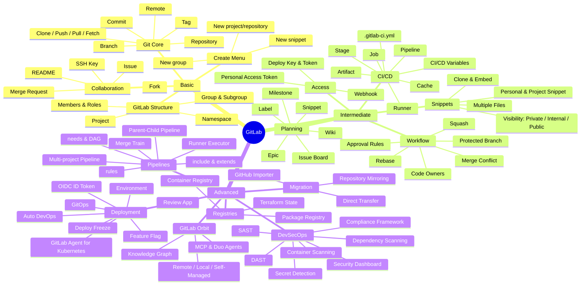

  

# GitLab Key Terminologies

The words you will see all over GitLab, grouped by level. Start with **Basic**, then work up to **Advanced**.

| Level           | Focus                                                            | Jump to                        |
| --------------- | ---------------------------------------------------------------- | ------------------------------ |
| 🟢 Basic        | Git & GitLab fundamentals, collaboration                         | [Basic](#-basic)               |
| 🟠 Intermediate | CI/CD, project workflow, access control                          | [Intermediate](#-intermediate) |
| 🔴 Advanced     | Advanced pipelines, DevSecOps, deployment, AI (Orbit), migration | [Advanced](#-advanced)         |

---

## 🧠 Mind Map

---

## 🟢 Basic

### Git Core

| Term                  | What it means                                                                | Example                                  |
| --------------------- | ---------------------------------------------------------------------------- | ---------------------------------------- |
| **Repository (repo)** | A folder tracked by Git that stores your files and their full history.       | `git init`                               |
| **Commit**            | A saved snapshot of changes with a message, author and unique SHA.           | `git commit -m "Add login page"`         |
| **Branch**            | An independent line of development. The default is usually `main`.           | `git checkout -b feature/login`          |
| **Tag**               | A named pointer to a specific commit, often used for releases.               | `git tag v1.0.0`                         |
| **Remote**            | A copy of the repo hosted elsewhere, e.g. on GitLab. Usually named `origin`. | `git remote -v`                          |
| **Clone**             | Download a full copy of a remote repo to your machine.                       | `git clone git@gitlab.com:group/app.git` |
| **Push**              | Upload your local commits to the remote.                                     | `git push origin main`                   |
| **Pull**              | Fetch remote changes and merge them into your branch.                        | `git pull`                               |
| **Fetch**             | Download remote changes without merging them.                                | `git fetch origin`                       |
| **HEAD**              | A pointer to the commit you currently have checked out.                      | `git log HEAD`                           |
| **.gitignore**        | A file listing paths Git should not track.                                   | `node_modules/`                          |

### GitLab Structure

| Term          | What it means                                                               | Example                                     |
| ------------- | --------------------------------------------------------------------------- | ------------------------------------------- |
| **Project**   | GitLab's home for one repository plus its issues, MRs, CI/CD, wiki, etc.    | `gitlab.com/acme/web-app`                   |
| **Group**     | A collection of projects and users, used to share permissions and settings. | `acme`                                      |
| **Subgroup**  | A group nested inside another group.                                        | `acme/backend`                              |
| **Namespace** | The user or group path a project lives under.                               | `acme/backend/`                             |
| **Member**    | A user added to a project or group.                                         | Project → Manage → Members                  |
| **Roles**     | Permission levels: Guest, Reporter, Developer, Maintainer, Owner.           | Developers can push to unprotected branches |

### Create Menu (➕)

The **+** button in the top bar is the quickest way to create things in GitLab.

| Option                     | What it does                                              | Choices inside                                                                                                          |
| -------------------------- | --------------------------------------------------------- | ----------------------------------------------------------------------------------------------------------------------- |
| **New project/repository** | Creates a new project, which comes with a Git repository. | Create blank project, Create from template, Import project (GitHub, Bitbucket, URL…), Run CI/CD for external repository |
| **New group**              | Creates a group to hold projects, subgroups and members.  | Create group, Import group (Direct Transfer)                                                                            |
| **New snippet**            | Creates a personal snippet. See [Snippets](#snippets).    | Title, description, files, visibility                                                                                   |

> **Note:** Inside a project or group, the **+** menu also shows options for that place, such as **New issue**, **New merge request**, **New branch**, **New subgroup** and **Invite members**.

**Other top-bar icons next to ➕**

| Icon               | What it shows                                                                     |
| ------------------ | --------------------------------------------------------------------------------- |
| **Issues**         | Open issues assigned to you.                                                      |
| **Merge requests** | MRs assigned to you or waiting for your review.                                   |
| **To-Do List**     | Items that need your action, like mentions, review requests and failed pipelines. |
| **Avatar**         | Your profile, status, preferences, and Edit profile.                              |

### Collaboration

| Term                   | What it means                                                                                                         | Example                        |
| ---------------------- | --------------------------------------------------------------------------------------------------------------------- | ------------------------------ |
| **Issue**              | A tracked task, bug or feature request.                                                                               | `#42 Fix broken login`         |
| **Merge Request (MR)** | A request to merge one branch into another, with review, discussion and CI results. GitHub calls this a Pull Request. | `feature/login → main`         |
| **Fork**               | Your own copy of someone else's project, used to contribute without write access.                                     | Fork → change → MR to upstream |
| **README.md**          | The landing page of a project, shown on its homepage.                                                                 | This file's parent             |
| **SSH Key**            | A key pair that lets you authenticate to GitLab without a password.                                                   | `ssh-keygen -t ed25519`        |

---

## 🟠 Intermediate

### CI/CD

| Term                     | What it means                                                                                               | Example                               |
| ------------------------ | ----------------------------------------------------------------------------------------------------------- | ------------------------------------- |
| **CI/CD**                | Continuous Integration / Continuous Delivery & Deployment: automatically build, test and ship every change. | Push → pipeline runs                  |
| **.gitlab-ci.yml**       | The YAML file in the repo root that defines your pipeline.                                                  | `stages: [build, test, deploy]`       |
| **Pipeline**             | One full run of your CI/CD jobs, triggered by a push, MR, schedule, etc.                                    | Pipeline `#1024` passed               |
| **Stage**                | A group of jobs that run in parallel. Stages run in order.                                                  | `build → test → deploy`               |
| **Job**                  | A single task in a pipeline, like running tests.                                                            | `unit_test: script: npm test`         |
| **Runner**               | An agent that picks up jobs and executes them.                                                              | Shared runners on GitLab.com          |
| **Artifact**             | Files a job produces that are saved and passed to later jobs or downloaded.                                 | `artifacts: paths: [dist/]`           |
| **Cache**                | Files reused between pipeline runs to speed them up.                                                        | `cache: paths: [node_modules/]`       |
| **CI/CD Variables**      | Key-value settings and secrets injected into jobs. Can be masked and protected.                             | `$DOCKER_PASSWORD`                    |
| **Predefined Variables** | Variables GitLab sets automatically.                                                                        | `$CI_COMMIT_SHA`, `$CI_COMMIT_BRANCH` |
| **Schedule**             | Runs a pipeline on a cron schedule.                                                                         | Nightly build at 02:00                |

### Workflow

| Term                 | What it means                                                                 | Example                            |
| -------------------- | ----------------------------------------------------------------------------- | ---------------------------------- |
| **Merge Conflict**   | Two branches changed the same lines, so Git cannot merge them automatically.  | `<<<<<<< HEAD` markers             |
| **Rebase**           | Replay your commits on top of another branch to keep history linear.          | `git rebase main`                  |
| **Squash**           | Combine several commits into one when merging.                                | "Squash commits" checkbox on an MR |
| **Cherry-pick**      | Apply a single commit from one branch onto another.                           | `git cherry-pick a1b2c3d`          |
| **Protected Branch** | A branch that only certain roles can push or merge to.                        | `main` protected to Maintainers    |
| **Approval Rules**   | The approvals an MR needs before it can merge.                                | 2 approvals from `@backend-team`   |
| **Code Owners**      | A `CODEOWNERS` file that assigns owners to paths and requires their approval. | `/api/ @backend-team`              |
| **Draft MR**         | An MR marked as not ready, so it cannot be merged.                            | Title prefix `Draft:`              |

### Planning

| Term            | What it means                                                                  | Example                         |
| --------------- | ------------------------------------------------------------------------------ | ------------------------------- |
| **Label**       | A tag for categorising issues and MRs.                                         | `bug`, `priority::high`         |
| **Milestone**   | A time-boxed goal that groups issues and MRs.                                  | `Sprint 12`, `v2.0`             |
| **Issue Board** | A Kanban view of issues organised by label or status.                          | To Do → Doing → Done            |
| **Epic**        | A group-level container for related issues.                                    | "User authentication revamp"    |
| **Wiki**        | Built-in documentation pages for a project or group.                           | Project → Plan → Wiki           |
| **Snippet**     | A shareable piece of code or text stored in GitLab. See [Snippets](#snippets). | A reusable `docker-compose.yml` |

### Snippets

A snippet is a small, versioned piece of code or text you want to keep or share without creating a whole project. Each snippet is a tiny Git repo behind the scenes.

**Types**

| Term                 | What it means                                                                     | Where to find it                           |
| -------------------- | --------------------------------------------------------------------------------- | ------------------------------------------ |
| **Personal Snippet** | Owned by your user, not tied to any project.                                      | Profile → Snippets, or **+** → New snippet |
| **Project Snippet**  | Belongs to one project. Its visibility can never be more open than the project's. | Project → Code → Snippets                  |

**Settings when creating or editing a snippet**

| Setting                  | What it does                                                                                 | Example                              |
| ------------------------ | -------------------------------------------------------------------------------------------- | ------------------------------------ |
| **Title**                | Required name for the snippet.                                                               | `Nginx reverse proxy config`         |
| **Description**          | Optional Markdown text explaining the snippet.                                               | How and where to use it              |
| **File name**            | Name of each file. The extension sets syntax highlighting.                                   | `nginx.conf`, `deploy.sh`            |
| **File content**         | The actual code or text.                                                                     | Paste your config                    |
| **Add another file**     | One snippet can hold multiple files (up to 10 by default).                                   | `Dockerfile` + `docker-compose.yml`  |
| **Visibility: Private**  | Only you (personal) or project members (project) can see it.                                 | Notes with internal hostnames        |
| **Visibility: Internal** | Any signed-in user of the instance can see it. Not available for new snippets on GitLab.com. | Shared helpers on a company GitLab   |
| **Visibility: Public**   | Anyone can see it, even without signing in.                                                  | A reusable `.gitlab-ci.yml` template |

**Actions on a saved snippet**

| Action                    | What it does                                                     | Example                                                         |
| ------------------------- | ---------------------------------------------------------------- | --------------------------------------------------------------- |
| **Edit / Delete**         | Change or remove the snippet. Every edit creates a new commit.   | Edit button on the snippet page                                 |
| **Clone**                 | Pull the snippet with Git, edit locally, push back.              | `git clone git@gitlab.com:snippets/<id>.git`                    |
| **Raw / Download / Copy** | View plain text, download a file, or copy its contents.          | Raw link for `curl`                                             |
| **Embed / Share**         | Public snippets can be embedded in a web page or shared by link. | `` |
| **Comments**              | Discuss the snippet in a thread below it.                        | Review feedback on a script                                     |

**Project-level setting**

| Setting                     | What it does                                                         | Where                                                                               |
| --------------------------- | -------------------------------------------------------------------- | ----------------------------------------------------------------------------------- |
| **Snippets feature toggle** | Turns project snippets on or off, or limits them to project members. | Project → Settings → General → Visibility, project features, permissions → Snippets |

> **Tip:** Never put secrets (passwords, tokens, keys) in a snippet, even a private one. Use [CI/CD Variables](#cicd) instead.

### Access

| Term                             | What it means                                                  | Example                          |
| -------------------------------- | -------------------------------------------------------------- | -------------------------------- |
| **Personal Access Token (PAT)**  | A token that acts as you when using the API or Git over HTTPS. | Scope: `read_api`                |
| **Project / Group Access Token** | A bot-user token scoped to one project or group.               | Used by automation scripts       |
| **Deploy Key**                   | An SSH key with read (or write) access to a single repo.       | A server pulling code            |
| **Deploy Token**                 | A username/token pair to pull code, images or packages.        | A Kubernetes pull secret         |
| **Webhook**                      | An HTTP callback GitLab sends when events happen.              | Notify Slack on pipeline failure |

---

## 🔴 Advanced

### Pipelines

| Term                        | What it means                                                              | Example                                            |
| --------------------------- | -------------------------------------------------------------------------- | -------------------------------------------------- |
| **Runner Executor**         | How a runner runs jobs: Shell, Docker, Kubernetes, Docker Machine, etc.    | `executor = "docker"`                              |
| **Runner Tags**             | Labels that route jobs to specific runners.                                | `tags: [gpu]`                                      |
| **rules**                   | Conditions that decide whether a job runs. Replaces `only` / `except`.     | `if: $CI_PIPELINE_SOURCE == "merge_request_event"` |
| **needs / DAG**             | Lets a job start as soon as its dependencies finish, ignoring stage order. | `needs: [build]`                                   |
| **include**                 | Pulls pipeline config from other files, projects or templates.             | `include: template: Jobs/SAST.gitlab-ci.yml`       |
| **extends / anchors**       | Reuse job definitions to keep YAML DRY.                                    | `extends: .default_job`                            |
| **Parent-Child Pipeline**   | A pipeline that triggers sub-pipelines in the same project.                | Monorepo per-service pipelines                     |
| **Multi-project Pipeline**  | A pipeline that triggers a pipeline in another project.                    | App triggers the deploy repo                       |
| **Merge Train**             | A queue that tests MRs together in merge order so `main` never breaks.     | Premium feature                                    |
| **Merged Results Pipeline** | Tests the MR as if it were already merged into the target branch.          | Catches integration breakage early                 |

### Registries

| Term                   | What it means                                      | Example                            |
| ---------------------- | -------------------------------------------------- | ---------------------------------- |
| **Container Registry** | A built-in Docker image registry for each project. | `registry.gitlab.com/acme/app:1.0` |
| **Package Registry**   | Hosts npm, Maven, PyPI, NuGet and other packages.  | `npm publish` to GitLab            |
| **Terraform State**    | GitLab-managed backend for Terraform state files.  | `backend "http"`                   |

### DevSecOps

| Term                     | What it means                                                               | Example                               |
| ------------------------ | --------------------------------------------------------------------------- | ------------------------------------- |
| **DevSecOps**            | Building security checks into every step of the DevOps lifecycle.           | Security scans in every MR            |
| **SAST**                 | Static Application Security Testing: scans source code for vulnerabilities. | SQL injection in code                 |
| **DAST**                 | Dynamic Application Security Testing: attacks a running app to find issues. | XSS on a live review app              |
| **Dependency Scanning**  | Finds known vulnerabilities in third-party libraries.                       | Vulnerable `lodash` version           |
| **Container Scanning**   | Scans Docker images for vulnerable OS packages.                             | CVE in base image                     |
| **Secret Detection**     | Catches leaked credentials in commits.                                      | AWS key pushed by mistake             |
| **License Compliance**   | Checks that dependency licenses follow your policy.                         | Block GPL in proprietary code         |
| **Security Dashboard**   | One view of vulnerabilities across projects.                                | Group → Secure → Security dashboard   |
| **Security Policy**      | Rules that enforce scans or block MRs with vulnerabilities.                 | Require approval on critical findings |
| **Compliance Framework** | Labels and pipelines that enforce regulatory requirements.                  | SOC 2, HIPAA projects                 |

### Deployment

| Term                            | What it means                                                                 | Example                               |
| ------------------------------- | ----------------------------------------------------------------------------- | ------------------------------------- |
| **Environment**                 | A named deployment target that GitLab tracks.                                 | `staging`, `production`               |
| **Protected Environment**       | An environment that only approved users can deploy to.                        | Prod deploys need Maintainer approval |
| **Review App**                  | A temporary environment spun up for each MR.                                  | `mr-42.review.example.com`            |
| **Auto DevOps**                 | A preset pipeline that builds, tests, scans and deploys with no config.       | Toggle in project settings            |
| **GitLab Agent for Kubernetes** | An in-cluster agent that connects GitLab to Kubernetes securely.              | `agentk`                              |
| **GitOps**                      | The Git repo is the source of truth, and the cluster syncs to it.             | Agent + Flux                          |
| **Feature Flag**                | Turn features on or off at runtime without redeploying.                       | Gradual rollout to 10% of users       |
| **Deploy Freeze**               | A time window when deployments are blocked.                                   | No deploys over the holidays          |
| **Release**                     | A versioned snapshot with notes and assets, tied to a tag.                    | `v2.1.0` release page                 |
| **OIDC ID Token**               | Short-lived tokens jobs use to authenticate to clouds without stored secrets. | `id_tokens:` to AWS/GCP/Vault         |

### GitLab Orbit (AI Context Graph)

GitLab Orbit (also called the **GitLab Knowledge Graph**) indexes your GitLab instance and turns your whole software lifecycle into one graph you can query. That graph covers code, MRs, pipelines, deployments, vulnerabilities and owners, plus the links between them. Humans and AI agents use it to answer questions that would otherwise need many API calls.

> **Status:** Beta (experiment in GitLab 18.10, beta in 19.1). **Tier:** Premium, Ultimate. Available on GitLab.com and Self-Managed. It is enabled per top-level group.

| Term                             | What it means                                                                                                                                                     | Example                                         |
| -------------------------------- | ----------------------------------------------------------------------------------------------------------------------------------------------------------------- | ----------------------------------------------- |
| **Knowledge Graph**              | A property graph where GitLab objects are **nodes** and their relationships are **edges**.                                                                        | `MergeRequest` → touches → `File`               |
| **SDLC data**                    | The lifecycle objects Orbit indexes: groups, projects, users, MRs, pipelines, work items, security findings.                                                      | "Which pipeline introduced this vulnerability?" |
| **Code indexing**                | Parses source code on the default branch to map definitions and references. Supports 12 languages: Ruby, Java, Kotlin, Python, TS, JS, Rust, Go, C#, C, C++, PHP. | "What calls this function?"                     |
| **Remote Orbit**                 | GitLab-hosted version on GitLab.com, backed by managed ClickHouse.                                                                                                | Enable on your top-level group                  |
| **Local Orbit**                  | The `orbit` CLI that indexes code on your machine (DuckDB). It works offline after install.                                                                       | Index a local repo for your IDE agent           |
| **Self-Managed Orbit**           | Runs on your own Kubernetes cluster next to your GitLab instance.                                                                                                 | Enterprise on-prem setup                        |
| **Access methods**               | Query the graph through REST API, **MCP** tools, the GitLab CLI, or the **GitLab Duo Agent Platform**.                                                            | Connect an AI agent through MCP                 |
| **MCP (Model Context Protocol)** | An open standard that lets AI agents call external tools and data sources.                                                                                        | Claude / Duo agent queries Orbit                |
| **GitLab Duo**                   | GitLab's AI features and agents. Orbit gives them full project context.                                                                                           | Duo agent explains blast radius of a change     |
| **Index cycle**                  | Orbit shows data as of the last index run, not live state.                                                                                                        | Results may lag recent pushes                   |

**Questions Orbit can answer**

- What breaks if I change this service?
- Which MRs touched this file in the last 90 days?
- Who has reviewed the most code in this group?
- Where are the open critical vulnerabilities, and which pipelines introduced them?

### Platform & Migration

| Term                           | What it means                                                                           | Example                               |
| ------------------------------ | --------------------------------------------------------------------------------------- | ------------------------------------- |
| **GitLab.com vs Self-Managed** | GitLab's SaaS versus GitLab installed on your own servers.                              | `gitlab.example.com`                  |
| **GitLab Dedicated**           | A single-tenant SaaS instance hosted by GitLab.                                         | Enterprises with compliance needs     |
| **Repository Mirroring**       | Automatically push or pull a repo between GitLab and another host.                      | Mirror GitHub → GitLab                |
| **GitHub Importer**            | Imports repos, issues, PRs and wiki from GitHub.                                        | New project → Import project → GitHub |
| **Direct Transfer**            | Migrates groups and projects between GitLab instances.                                  | Self-managed → GitLab.com             |
| **GitHub Actions → GitLab CI** | Mapping workflows to `.gitlab-ci.yml`: workflow → pipeline, job → job, runner → runner. | `on: push` → `rules:`                 |

---

<a href="README.md">⬅ Back to README</a>

