<p align="center">
  
</p>

# GitLab-Complete-Guide

A complete GitLab guide covering GitLab basics to advanced concepts, including Git workflows, Merge Requests, CI/CD pipelines, Runners, DevSecOps, Container Registry, deployments, and real-world GitHub-to-GitLab migration workflows.

## 📚 Contents

<a href="KEY-TERMINOLOGIES.md">
  
</a>

| #   | Topic                                     | Covers                                                 |
| --- | ----------------------------------------- | ------------------------------------------------------ |
| 1   | [Key Terminologies](KEY-TERMINOLOGIES.md) | Mind map + Basic, Intermediate & Advanced GitLab terms |

## 🤝 Contributing

Contributions are welcome, whether it's a new term, a fix, a better example or a whole new topic.

### How to contribute

1. **Fork** this repo and clone your fork.
   ```bash
   git clone git@github.com:<your-username>/GitLab-Complete-Guide.git
   cd GitLab-Complete-Guide
   ```
2. **Create a branch** for your change.
   ```bash
   git checkout -b docs/add-runner-terms
   ```
3. **Make your changes** (see the guidelines below).
4. **Commit** using [Conventional Commits](https://www.conventionalcommits.org/).
   ```bash
   git commit -m "docs(terminologies): add runner executor examples"
   ```
5. **Push** and open a **Pull Request** against `main`, explaining what you changed and why.

### Guidelines

- **Match the existing style.** Terms go in the `| Term | What it means | Example |` table format, under the right level (🟢 Basic, 🟠 Intermediate, 🔴 Advanced).
- **Keep it simple.** Write short, plain-English explanations a beginner can follow, plus one concrete example.
- **Update the mind map** in [KEY-TERMINOLOGIES.md](KEY-TERMINOLOGIES.md) when you add a new section or term.
- **Link new topics** in the Contents table above.
- **Check facts against the [official GitLab docs](https://docs.gitlab.com/)**, and note the tier or status for paid or beta features.
- **No secrets.** Never commit real tokens, passwords or internal URLs, even in examples.
- **Preview before pushing.** Make sure tables and Mermaid diagrams render on GitHub.

### Other ways to help

- 🐛 Found a mistake or an outdated feature? [Open an issue](https://github.com/Ashukr321/GitLab-Complete-Guide/issues).
- 💡 Have an idea for a new topic? Open an issue to discuss it first.
- ⭐ Star the repo if it helped you.

## 📄 License

This project is licensed under the [MIT License](LICENSE).
